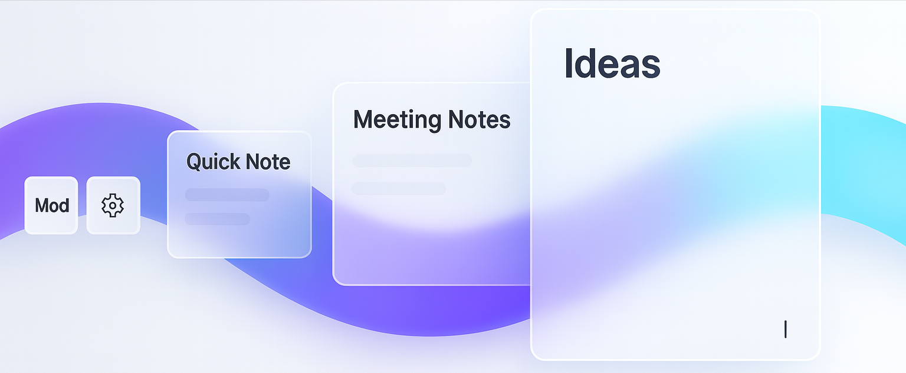

# Obsidian PopNote

A powerful Obsidian plugin that enables system-wide pop note creation and management through global hotkeys.

## Demonstration (Coming soon)

## Features

### Global Pop Note Creation

- **System-wide hotkey** to create, hide or show pop notes from anywhere, even when Obsidian is not focused (but you need to keep the vault open to use the hotkey)
- Pop notes open in a floating window separate from the Obsidian main window, keeping your main workspace undisturbed
- **Hide/Show Pattern**: Windows are hidden rather than closed, preserving state and improving performance
- Smart window management prevents duplicate windows

### Intelligent Note Management
- **Buffer Time System**: 
  - Reuse recently created notes within a configurable time window
  - Options: Always create new, Always reuse last, or Custom duration (in minutes)
- **Custom Note Naming**: Flexible naming patterns with variables like `{{date}}`, `{{time}}`, `{{year}}`, `{{month}}`, etc.
- **Template Support**: Apply templates automatically to new pop notes
- **File Tracking**: Tracks files by creation time to handle renames gracefully

### Navigation Features

- **Previous/Next Navigation**: Quickly navigate between your pop notes using keyboard shortcuts
- **Smart Navigation**: When at the newest note, pressing "next" prompts to create a new note
- **Sort Options**: Order notes by creation time or last modified time
- **Cursor Position Memory**: Remembers cursor position for each file across navigation

### Pop Notes Picker
- **Native Obsidian interface** using the built-in fuzzy search modal
- **Keyboard-driven workflow** with configurable shortcuts:
  - `Enter`: Open in current tab
  - `Cmd/Ctrl+Enter`: Open in new tab (configurable)
  - `Opt/Alt+Enter`: Open in new window (configurable)
  - `Cmd/Ctrl+P`: Pin/unpin note (configurable)
  - `Cmd/Ctrl+D`: Delete note (configurable)
- **Pin important notes** to keep them at the top of the list
- **Smart sorting**: Pinned notes appear first, followed by others in your preferred order

### Advanced Window Features

- **Floating Windows**: 
  - Always-on-top option for persistent visibility
  - Three window level options:
    - **Fullscreen**: Appears above fullscreen apps (may affect macOS dock behavior)
    - **Floating**: Always on top with better dock integration (cannot above fullscreen apps)
    - **Normal**: Standard window behavior
  - Visible on all workspaces (macOS) - available with Fullscreen level (you will need to open this option to have the floating window above fullscreen apps)
- **Window Position & Size**:
  - Remember the last position and size
  - Fixed size option
  - Position presets: center, left, right, or last position
- **Cursor Position**:
  - Options: start, end, or last remembered position
  - Persists across file switches and renames
- **Session Persistence**: PopNote windows reconnect after Obsidian restart

## Installation

### From Obsidian Community Plugins (Coming Soon)

**Will submit the community plugin marketplace after testing on Linux and Windows.**

1. Open Settings → Community Plugins
2. Search for "PopNote"
3. Install and enable the plugin

### Manual Installation
1. Download the latest release from GitHub
2. Extract files to your vault: `VaultFolder/.obsidian/plugins/popnote/`
3. Reload Obsidian
4. Enable the plugin in Settings → Community Plugins

## Documentation

📚 **[Features Guide](./docs/features.md)** - Comprehensive guide explaining all features with examples  
⚙️ **[Settings Reference](./docs/settings.md)** - Detailed reference for every setting and configuration option

## Quick Configuration

### Pop Notes Settings
- **Pop notes folder**: Specify where to store your pop notes
- **Note name pattern**: Customize how notes are named with variables like `{{date}}`, `{{time}}`
- **Template file**: Select a template to apply to new notes
- **Buffer time**: Configure note reuse behavior (always new, always reuse, or time-based)
- **Sort order**: Choose between creation time or modification time

### Window Settings
- **Window Size**: Fixed size mode or remember last size
- **Window Position**: Center, left, right, or remember last position
- **Floating Windows**: Always-on-top with configurable priority levels
- **Cursor Position**: Start, end, or remember the last position

### Hotkeys
- **Global hotkey**: System-wide shortcut
- **Navigation hotkeys**: Configure in Obsidian Settings → Hotkeys
- **Picker shortcuts**: Customizable shortcuts for pin, delete, and open actions

For complete details on all settings and features, please refer to the documentation linked above.

## Usage

### Creating Pop Notes
1. Press your configured global hotkey from anywhere
2. A new pop note opens in a popup window
3. Start typing immediately - the note is automatically saved

### Navigating Notes
- Use navigation hotkeys to move between notes in chronological order
- At the newest note? Press "next" again to create a new note
- Use the picker (`Ctrl/Cmd+Shift+P`) for visual browsing

### Managing Notes
- Use the Pop Notes Picker (`Cmd/Ctrl+Shift+P`) for a native Obsidian experience
- Navigate with the arrow keys and use Enter to open in the current tab
- Pin frequently used notes with your configured shortcut
- Delete notes quickly with your configured shortcut
- Open in new tab (`Cmd/Ctrl+Enter`) or new window (`Opt/Alt+Enter`)
- Pop notes follow your vault's normal sync and backup rules

## Tips & Tricks

1. **Pop Capture Workflow**: Set buffer time to "permanent" to maintain a single daily capture note
2. **Project Notes**: Use different note patterns for different projects by changing settings
3. **Floating Notes**: 
   - Use "Fullscreen" level (with visible on all workspaces option open) to keep notes visible over fullscreen apps.
   - Use "Floating" level for better dock integration on macOS.
   - Use "Normal" level if you don't need always-on-top behavior.
4. **Template Variables**: Create rich templates with date/time variables for automatic timestamps
5. **Quick Access**: Set window position to "last" and cursor to "last" for seamless workflow continuation
6. **Multi-Desktop**: Enable "visible on all workspaces" (macOS) to access your PopNote from any desktop space

## Requirements

- Theoretically working with Obsidian v1.6.0 or higher, tested on Obsidian v1.8.10
- Desktop only (uses Electron APIs for global hotkeys)

## Support

If you find this plugin helpful, consider supporting its development:
- [GitHub Sponsors](https://github.com/sponsors/jiywww) (waiting for reviewing)
- Report issues on [GitHub](https://github.com/jiywww/obsidian-popnote/issues)

## License

MIT License - see LICENSE file for details

## Credits

Built with ❤️ for the Obsidian community by jiywww
